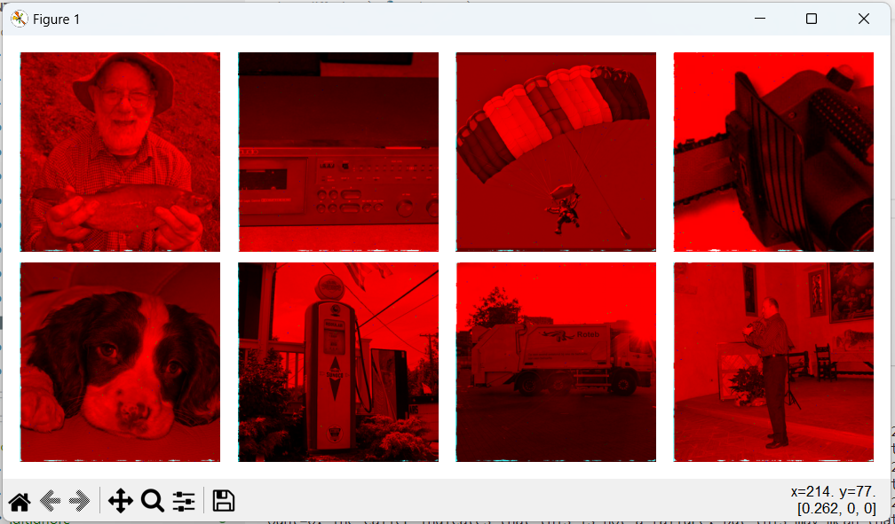

# Coloring with diffusion (not working at the moment)

It's an attempt to use machine learning to color grayscale images, based on the example at https://keras.io/examples/generative/ddim/

I'm converting the image layers to HSV, and applyimg diffusion on the hue and saturation channels, using the value channel unmodified, only as an input

At it's current state, it just paints everything red like this:

